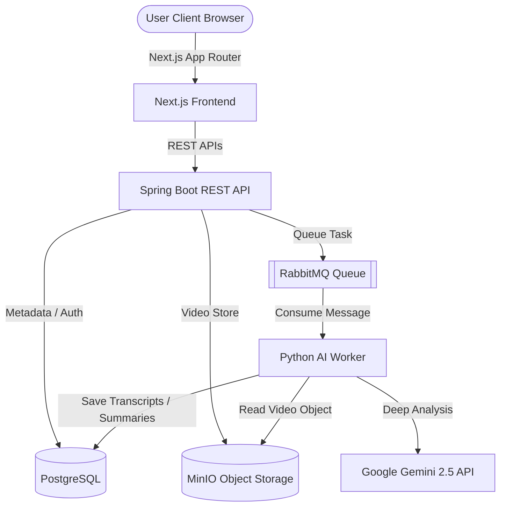

# 📹 VisiCore AI — Enterprise Video Understanding Platform

VisiCore AI is a next-generation, high-performance **Enterprise AI Video Understanding & Semantic Indexing Platform**. Built with modern software architecture, VisiCore AI transcribes, indexes, and analyzes multi-format video feeds using Google Gemini AI, offering context-aware timeline queries, high-fidelity summaries, and interactive Copilot chats.

---

## 🌟 Key Features

* **⚡ Real-Time Video Ingestion**: Securely upload large video files through standard multipart streams.
* **🧠 Gemini-Powered Telemetry**: Automatic video transcription, scene mapping, and visual summary generations powered by `gemini-2.5-flash`.
* **💬 Gemma 4 Copilot**: Context-aware chat assistant that lets you query specific moments, ask contextual questions, and retrieve exact clickable timestamps to seek directly in the video.
* **⏱️ Interactive Visual Timelines**: Clickable semantic timestamps mapped directly to video timestamps for instant timeline navigation.
* **⚙️ Scalable Microservice Architecture**: Decoupled asynchronous worker queue structure to process multiple parallel ingestion pipelines.
* **🌌 Modern Premium UI**: High-fidelity Glassmorphic Dark UI featuring tailored micro-animations, active transforms, and stable layout designs.

---

## 📐 Platform Architecture

VisiCore AI is structured as a robust multi-service environment:



1. **Frontend (`/web`)**: Next.js App Router, Tailwind CSS, TypeScript, TanStack Query, Lucide icons, and Zustand for state management.
2. **Backend API (`/api`)**: Java Spring Boot, Spring Security (JWT auth), Spring Data JPA, PostgreSQL, MinIO SDK, and RabbitTemplate.
3. **AI Worker (`/ai-worker`)**: Python 3, Google GenAI SDK, RabbitMQ (`pika`), MinIO, and `psycopg2` for direct database result storage.
4. **Infra Stack (`docker-compose.yml`)**: PostgreSQL (port 5432), MinIO (port 9000/9001), RabbitMQ (port 5672/15672).

---

## 🚀 Quick Start Guide

### Prerequisites
Make sure you have the following installed on your system:
* **Docker & Docker Compose**
* **Java 17+ & Maven**
* **Node.js 18+ (npm/pnpm/yarn)**
* **Python 3.9+**
* **Google Gemini API Key** (Get yours from [aistudio.google.com](https://aistudio.google.com))

---

### 1. Ingest Infrastructure (Docker)
Launch the backing databases, queues, and object storage:
```bash
docker-compose up -d
```
* **MinIO Console**: `http://localhost:9001` (Credentials: `minioadmin` / `minioadmin`)
* **RabbitMQ Dashboard**: `http://localhost:15672` (Credentials: `guest` / `guest`)
* **PostgreSQL**: `localhost:5432` (`aivideodb` / `admin` / `password`)

---

### 2. Configure & Start Backend API (Spring Boot)
1. Configure credentials in `api/src/main/resources/application.yml` (if needed).
2. Start the API server:
```bash
cd api
./mvnw spring-boot:run
```
* **API Server Endpoint**: `http://localhost:8080`

---

### 3. Start python AI Worker
1. Navigate to the worker folder:
```bash
cd ai-worker
```
2. Initialize virtual environment and install dependencies:
```bash
python3 -m venv venv
source venv/bin/activate
pip install -r requirements.txt
```
3. Set your Gemini API key in a `.env` file in the `ai-worker/` folder:
```env
GEMINI_API_KEY=YOUR_GEMINI_API_KEY_HERE
```
4. Start the worker process:
```bash
python worker.py
```

---

### 4. Start Next.js Web Dashboard
1. Navigate to the web folder:
```bash
cd web
```
2. Install client dependencies:
```bash
npm install
```
3. Start the Next.js development server:
```bash
npm run dev
```
* **Web UI Dashboard**: `http://localhost:3000`

---

## 🔒 Security & Best Practices
* **Zero Secret Leakage**: The Python AI worker uses safe `.env` integration, preventing the leakage of precious Gemini keys during codebase versioning.
* **Token Protection**: JWT validation on every secured gateway endpoint.
* **CORS & CORS-origins**: Locked down strictly to authorized client domains.
