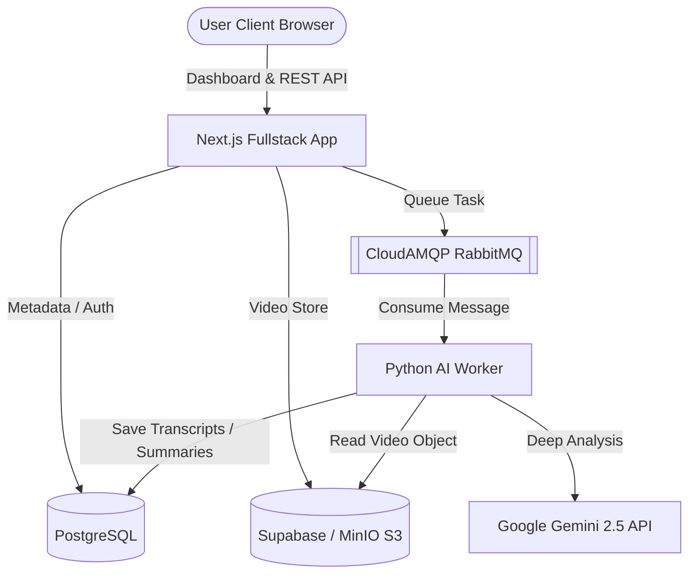

# 📹 VisiCore AI — Enterprise Video Understanding Platform

<p align="center">
  
  
  
  
  
</p>

VisiCore AI is a next-generation, high-performance **Enterprise AI Video Understanding & Semantic Indexing Platform**. Built with a state-of-the-art modern software architecture, VisiCore AI transcribes, indexes, and analyzes multi-format video feeds using Google Gemini AI, offering context-aware timeline queries, high-fidelity summaries, and interactive Copilot chats.

---

## 🌟 Key Features

*   **⚡ Real-Time Video Ingestion**: Securely upload large video files through standard multipart streams.
*   **🧠 Gemini-Powered Telemetry**: Automatic video transcription, scene mapping, and visual summary generations powered by `gemini-2.5-flash`.
*   **💬 Gemma 4 Copilot**: Context-aware chat assistant that lets you query specific moments, ask contextual questions, and retrieve exact clickable timestamps to seek directly in the video.
*   **⏱️ Interactive Visual Timelines**: Clickable semantic timestamps mapped directly to video timestamps for instant timeline navigation.
*   **⚙️ Scalable Microservice Architecture**: Decoupled asynchronous worker queue structure to process multiple parallel ingestion pipelines.
*   **🌌 Modern Premium UI**: High-fidelity Glassmorphic Dark UI featuring tailored micro-animations, active transforms, and stable layout designs.

---

## 📐 Platform Architecture

VisiCore AI is structured as a fullstack Next.js web application paired with an autonomous Python AI processing worker:


```mermaid
graph TD
    User([User Client Browser]) -->|Dashboard & REST API| Fullstack[Next.js Fullstack App]
    Fullstack -->|Metadata / Auth| DB[(PostgreSQL)]
    Fullstack -->|Video Store| Storage[(Supabase / MinIO S3)]
    Fullstack -->|Queue Task| MQ[[CloudAMQP RabbitMQ]]
    MQ -->|Consume Message| Worker[Python AI Worker]
    Worker -->|Read Video Object| Storage
    Worker -->|Deep Analysis| Gemini[Google Gemini 2.5 API]
    Worker -->|Save Transcripts / Summaries| DB
```

1.  **Next.js Fullstack App (`/web`)**: Next.js App Router, Route Handlers (`/api/*`), Tailwind CSS, TypeScript, TanStack Query, Lucide icons, and Zustand. Handles authentication, video upload ingestion, task queueing, database queries, and dashboard UI.
2.  **AI Worker (`/ai-worker`)**: Python 3, Google GenAI SDK, RabbitMQ (`pika`), MinIO, and `psycopg2` for direct database result storage. *Runs locally or as a cloud background process.*

---

## 🚀 Quick Start Guide

### Prerequisites
Make sure you have the following installed on your system:
*   **Docker & Docker Compose**
*   **Node.js 18+ (npm/pnpm/yarn)**
*   **Python 3.9+**
*   **Google Gemini API Key** (Get yours from [aistudio.google.com](https://aistudio.google.com))

---

### 1. Ingest Infrastructure (Docker)
Launch the backing databases, queues, and object storage:
```bash
docker-compose up -d
```
*   **MinIO Console**: `http://localhost:9001` (Credentials: `minioadmin` / `minioadmin`)
*   **RabbitMQ Dashboard**: `http://localhost:15672` (Credentials: `guest` / `guest`)
*   **PostgreSQL**: `localhost:5432` (`aivideodb` / `admin` / `password`)

---

### 2. Start Next.js Fullstack App
1.  Navigate to the web folder:
```bash
cd web
```
2.  Install dependencies:
```bash
npm install
```
3.  Run route handler tests:
```bash
npm run test
```
4.  Start the development server:
```bash
npm run dev
```
*   **Web Dashboard & API**: `http://localhost:3000`

---

### 3. Start Python AI Worker
1.  Navigate to the worker folder:
```bash
cd ai-worker
```
2.  Initialize virtual environment and install dependencies:
```bash
pip install -r requirements.txt
```
3.  Configure your environment variables in `.env` inside `ai-worker/`.
4.  Start the worker process:
```bash
python worker.py
```

---

## 🔒 Security & Best Practices
*   **Decoupled Secret Storage**: Secure `.env` environment isolation prevents any leaks of valuable API keys.
*   **JWT Authentication**: Stateless, encrypted bearer tokens for securing video metadata endpoints.
*   **Secure Queue Channels**: AMQPS SSL wrapper protocols enabled in production to encrypt pipeline traffic between backend processes.
